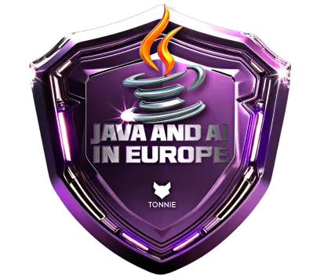

<pre style="font-size: 0.6rem;">

                              \\\\\\
                           \\\\\\\\\\\\
                          \\\\\\\\\\\\\\\
-------------,-|           |C>   // )\\\\|    .o88b. db   db  .d8b.  db    db  .d8b.  d888888b d888888b d88888b
           ,','|          /    || ,'/////|   d8P  Y8 88   88 d8' '8b 88    88 d8' '8b '~~88~~' '~~88~~' 88'  
---------,','  |         (,    ||   /////    8P      88ooo88 88ooo88 Y8    8P 88ooo88    88       88    88ooooo 
         ||    |          \\  ||||//''''|    8b      88~~~88 88~~~88 '8b  d8' 88~~~88    88       88    88~~~~~ 
         ||    |           |||||||     _|    Y8b  d8 88   88 88   88  '8bd8'  88   88    88       88    88.   
         ||    |______      ''''\____/ \      'Y88P' YP   YP YP   YP    YP    YP   YP    YP       YP    Y88888P
         ||    |     ,|         _/_____/ \
         ||  ,'    ,' |        /          |                 ___________________________________________
         ||,'    ,'   |       |         \  |              / \                                           \ 
_________|/    ,'     |      /           | |             |  |                                            | 
_____________,'      ,',_____|      |    | |              \ |      chavatte@duck.com                     | 
             |     ,','      |      |    | |                |                        chavatte.42web.io   | 
             |   ,','    ____|_____/    /  |                |    ________________________________________|___
             | ,','  __/ |             /   |                |  /                                            /
_____________|','   ///_/-------------/   |                 \_/____________________________________________/ 
              |===========,'                                                                                
			  

</pre>

# **Bootcamp - TONNIE - Java and AI in Europe**

Este repositório contém os projetos desenvolvidos durante o Bootcamp TONNIE - Java and AI in Europe. Alinhando o conhecimento de APIs robustas, Inteligência Artificial em soluções de software e boas práticas de DevOps no desenvolvimento de sistemas com Java.

## Objetivo

Desenvolver profissionais capazes de criar e manter sistemas robustos e seguros utilizando Java, com foco em Inteligência Artificial, APIs e práticas de DevOps.

## Conteúdo Programático

* **Desenvolvimento de Sistemas com Java:** Fundamentos e práticas avançadas na linguagem de programação Java.
* **APIs Robustas:** Criação e gerenciamento de Interfaces de Programação de Aplicação seguras e eficientes.
* **Inteligência Artificial:** Aplicação de IA em soluções de software para inovação e otimização.
* **Boas Práticas de DevOps:** Integração de desenvolvimento e operações para agilizar o ciclo de vida de desenvolvimento de software.
* **Fundamentos de Cibersegurança:** Conceitos essenciais para a proteção de sistemas e dados.

## **Projetos**

* **LAB-01: Criando um Ebook com Gemini & Google AI Studio** [Link para o projeto](./projects/LAB-01/README.md)

* **LAB-02: Abstraindo um Bootcamp Usando Orientação a Objetos em Java** [Link para o projeto](./projects/LAB-02/README.md)

* **LAB-03: Criando um Jogo do Sudoku em Java** [Link para o projeto](./projects/LAB-03/README.md)

* **LAB-04: Design Patterns com Java: Dos Clássicos (GoF) ao Spring Framework** [Link para o projeto](./projects/LAB-04/hotelReservation/README.md)

* **LAB-05: Criando seu Board de Tarefas com Java** [Link para o projeto](./projects/LAB-05/chavatteboard/README.md)

* **LAB-06: Criando um Deploy de uma Aplicação** [Link para o projeto](./projects/LAB-06/README.md)

## Certificado de conclusão

 🎓 [TONNIE Bootcamp Java and AI](https://www.dio.me/certificate/W2SSAIIY)