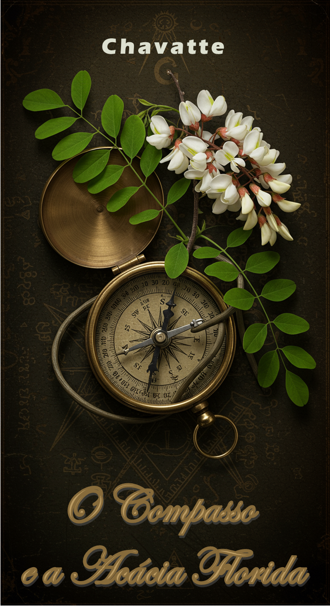

# LAB-01: Criando um Ebook com Gemini & Google AI Studio

 📖 [Ficção] O Compasso e a Acácia Florida [**Clique aqui para ler**](./output/O_Compasso_e_a_Acacia_Florida.pdf)

Este repositório documenta o processo de criação de um livro de ficção histórica e mistério, desenvolvido em colaboração entre um usuário e a I.A. Gemini. O projeto abrange desde a concepção da premissa e dos personagens até a geração do texto completo e da identidade visual da capa.

## 🎯 Objetivo

Gerar um produto editorial completo (ebook de ficção) utilizando as facilidades e a colaboração criativa de ferramentas de Inteligência Artificial, documentando o processo através da engenharia de prompts para garantir a replicabilidade e o estudo do método.

## 📦 Componentes do Projeto

* **World-building e Personagens:** Criação de protagonistas e um enredo original com base em temas históricos e simbólicos.
* **Estrutura Narrativa:** Desenvolvimento de um roteiro detalhado dividido em 3 atos e 10 capítulos.
* **Geração de Conteúdo:** Escrita completa de todos os capítulos do livro.
* **Identidade Visual:** Criação da arte da capa através de geração de imagem por IA.
* **Documentação Técnica:** Registro de todos os prompts estruturados utilizados no processo criativo.

## 💻 Tecnologias Utilizadas

* **Gemini:** Para toda a criação textual, incluindo personagens, enredo, capítulos e descrições.
* **Google AI Studio (Generate Media / Generate Image):** Para a geração da arte da capa.
* **Microsoft Word:** Para a compilação e edição inicial do texto.
* **Microsoft Publisher:** Para a diagramação final e montagem do ebook.

## 🧠 Engenharia de Prompt (Processo Criativo)

A seguir, a documentação detalhada dos prompts utilizados para guiar as IAs na criação do conteúdo.

#### **Gemini (Modelo de Linguagem - Geração de Texto):**

1. **Concepção de Personagens:**

   > **Papel:** Você é um roteirista e consultor de  *world-building* , especialista em simbolismo maçônico e história do século XVIII.
   >

   > **Contexto:** Estou desenvolvendo uma trama de ficção histórica. O tema central é a Maçonaria, mas com uma abordagem original e fictícia. Preciso de dois protagonistas, um homem e uma mulher, cujos nomes e histórias de fundo tenham ressonância com a simbologia maçônica.
   >

   > **Comando:** Crie um nome masculino e um feminino. Para cada um, desenvolva um parágrafo conceitual explicando a origem fictícia do nome e sua ligação simbólica com os princípios ou a história da Ordem.
   >

   > **Parâmetros:** `[Criatividade: Alta], [Fidelidade Histórica: Indireta/Simbólica], [Tom: Misterioso, Intelectual], [Saída: Texto descritivo].`
   >
2. **Estruturação do Enredo:**

   > **Papel:** Você assume o papel de um arquiteto narrativo ou roteirista sênior.
   >

   > **Contexto:** Utilizando os personagens "Eliphas" e "Acácia" previamente criados, vamos estruturar um conto completo. A trama deve girar em torno da tensão entre a tradição (Eliphas) e a inovação (Acácia), forçados a uma aliança contra uma facção corrupta que ameaça a Ordem por dentro. O cenário é Paris, 1788.
   >

   > **Comando:** Desenvolva um plano de enredo detalhado, dividido em uma estrutura clássica de 3 atos e 10 capítulos. Para cada capítulo, defina: `[Título do Capítulo]`, `[Foco Narrativo]`, `[Cenário Principal]`, `[Ação Chave]` e `[Impacto na Trama]`.
   >

   > **Parâmetros:** `[Estrutura: 3 Atos], [Clímax: Confronto intelectual e simbólico], [Resolução: Conclusiva para a trama, esperançosa para o futuro].`
   >
3. **Geração de Capítulos (Template Genérico):**

   > **Papel:** `Você agora assume o papel de um romancista de ficção histórica, com um estilo de escrita imersivo e atmosférico.`
   >

   > **Contexto:** `Estamos executando o plano de enredo para "O Compasso e a Acácia Florida". O comando atual é para gerar um capítulo específico da obra, seguindo os objetivos definidos para ele no plano de enredo.`
   >

   > **Comando:** `Escreva o`  **`[Inserir Número e Título do Capítulo]`** , `garantindo que a narrativa cumpra todos os pontos-chave (cenário, ação, desenvolvimento de personagem) delineados no plano para este segmento da história.`
   >

   > **Parâmetros:** `Os parâmetros de Tom, Ritmo e Foco em detalhes sensoriais são ajustados a cada capítulo para servir à história (ex: Ação, Suspense, Diálogo reflexivo), mantendo sempre a` **`[Qualidade: Literária e Imersiva]`** `como padrão.`
   >

#### **Google AI Studio (Modelo de Imagem - Geração Visual):**

4. **Arte da Capa:**
   > **Sujeito:** `An antique, intricate brass compass, open. A delicate branch of a flowering acacia tree, with white blossoms, is elegantly intertwined around the compass.`
   > **Cenário e Fundo:** `The background is a dark, textured surface like aged vellum or a crypt wall. Faint, almost invisible, Masonic symbols are etched into the background.`
   > **Estilo e Iluminação:** `Style: realistic yet fantastical book cover illustration. Lighting: high-contrast chiaroscuro reminiscent of a Caravaggio painting. A single, focused light source highlights the gleam of the brass and the pale flowers, creating deep shadows.`
   > **Atmosfera e Composição:** `Mood: mysterious, historical, deeply symbolic. Composition: balanced, dynamic, emphasizing the interplay between the metallic compass and the organic acacia.`
   >

## 🚀 Materiais e Execução

* **Materiais:** As imagens e o ebook finalizado podem ser encontrados nos diretórios `assets/` e `output/` respectivamente.
* **Execução:** Para replicar ou adaptar o projeto, utilize os prompts detalhados acima nas ferramentas sugeridas. A montagem final do material pode ser feita em softwares de edição de texto e diagramação como o Word e o Publisher.

## ✒️ Conclusão

Este projeto serve como um *case study* prático sobre a colaboração criativa entre humanos e I.A.s para a produção de conteúdo literário e visual.
