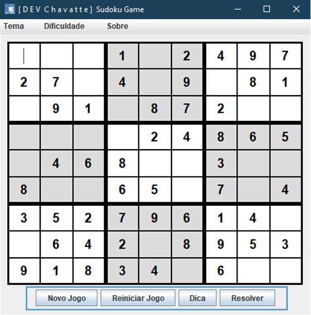
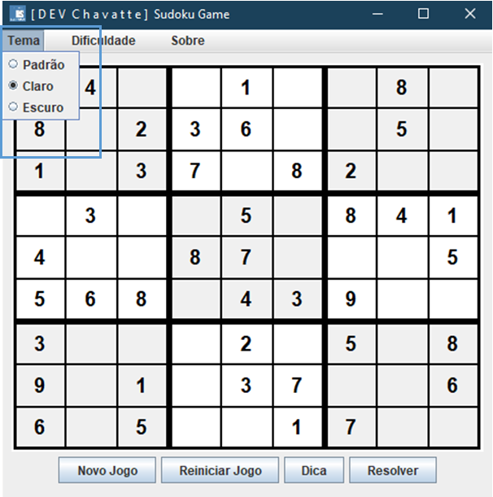
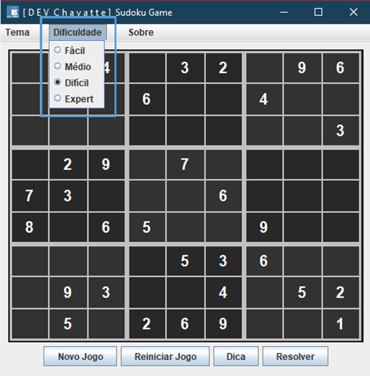
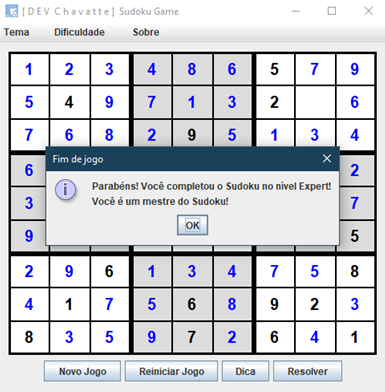

# LAB-03: Criando um Jogo do Sudoku em Java

## Descrição

Este projeto implementa um jogo de Sudoku em Java com interface gráfica Swing. O jogo oferece as seguintes funcionalidades:

* Geração de tabuleiros com diferentes níveis de dificuldade.
* Validação da entrada do usuário.
* Verificação se o jogo foi concluído.
* Opção de reiniciar o jogo.
* Dicas para o jogador.
* Resolução automática do Sudoku.

## Tecnologias Utilizadas

* Java
* Swing (para a interface gráfica)
* Maven (para gerenciamento de dependências)

## Aprendizado

O desenvolvimento deste projeto proporcionou o aprendizado em diversas áreas, tais como:

* **Lógica de programação:** Implementação da lógica do jogo, incluindo a geração de tabuleiros, validação de jogadas, verificação de término do jogo e resolução automática do Sudoku.
* **Programação orientada a objetos:** Utilização de conceitos como classes, objetos, herança, polimorfismo e encapsulamento para organizar e estruturar o código.
* **Interface gráfica com Swing:** Criação de interfaces gráficas utilizando componentes Swing, como botões, painéis, campos de texto e layouts.
* **Manipulação de eventos:** Gerenciamento de eventos do usuário, como cliques de mouse e entradas de teclado, para interagir com o jogo.
* **Gerenciamento de dependências com Maven:** Utilização do Maven para gerenciar as dependências do projeto, facilitando a inclusão de bibliotecas externas.
* **Boas práticas de desenvolvimento:** Aplicação de boas práticas de desenvolvimento, como organização do código, nomenclatura clara e comentários explicativos, para garantir a qualidade e a manutenibilidade do software.

Além disso, o projeto permitiu o desenvolvimento de habilidades como:

* **Resolução de problemas:** Identificação e correção de erros e bugs durante o desenvolvimento.
* **Pensamento lógico:** Criação de algoritmos e estruturas de dados para implementar a lógica do jogo.

## Instalação

**Bash**

```
# Clonando o Bootcamp:
git clone https://github.com/chavatte/LAB-TONNIE-Java-AI.git

```
**Bash**

```
# Compilando o jogo:
cd LAB-TONNIE-Java-AI/projects/LAB-03/Sudoku
mvn compile

```

**Bash**

```
# Execute o jogo:
mvn exec:java -Dexec.mainClass="dev.chavatte.sudoku.Main"

# ou somente:
mvn exec:java

```

## Como Jogar

* **Inicie um novo jogo:** Clique no botão "Novo Jogo" e selecione o nível de dificuldade desejado.
* **Preencha as células:** Clique em uma célula vazia e digite um número de 1 a 9.
* **Validação:** O jogo valida automaticamente cada número inserido. Se o número for inválido, ele será destacado em vermelho.
* **Reiniciar:** Clique no botão "Reiniciar Jogo" para reiniciar o jogo atual.
* **Dica:** Clique no botão "Dica" para obter uma dica. A célula com a dica será preenchida automaticamente.
* **Resolver:** Clique no botão "Resolver" para resolver o Sudoku automaticamente.
* **Fim de jogo:** Quando você completar o Sudoku corretamente, uma mensagem de parabéns será exibida.

## Telas do Jogo

### Telas da janela principal:

**Botões:** 
* "Novo Jogo", "Reiniciar Jogo", "Dica", "Resolver".



**ComboBox para selecionar o tema:** 
* "Padrão", "Claro", "Escuro".




**ComboBox para selecionar o nível de dificuldade:**
* "Fácil", "Médio", "Difícil", "Expert"



### Screen de finalização do jogo:



## Exemplo de Uso

* Clone o repositório e compile o projeto.
* Execute o jogo.
* Inicie um novo jogo no nível de dificuldade a sua escolha,  padrão:"Médio".
* Tente resolver o Sudoku.
* Se precisar de ajuda, use o botão "Dica".
* Se não conseguir resolver, use o botão "Resolver" para ver a solução.

## Distribuição

* **Release do SudokuGame:** [Versão: 1.0.0-Beta](https://github.com/chavatte/LAB-BRADESCO-JAVA-CLOUD-NATIVE/releases/tag/V1.0.0-Beta)
* **Baixe o instalador(link Direto):** [📦 SudokuGame Installer v1.0.0](https://github.com/chavatte/LAB-BRADESCO-JAVA-CLOUD-NATIVE/releases/download/V1.0.0-Beta/SudokuGame-Installer-1.0.0.msi)
* **Verificação VirusTotal:** [SudokuGame Verificação](https://www.virustotal.com/gui/file/6477f09f02ae89e778613661e9eff316050002b2f2e0ea44a667d570e71ee979/detection)
* **Hash SHA-256:** `6477f09f02ae89e778613661e9eff316050002b2f2e0ea44a667d570e71ee979`

## Conclusão

Este projeto demonstra a implementação eficiente de um jogo Sudoku em Java, utilizando a biblioteca Swing para a interface gráfica. A estrutura do código é organizada e modular, facilitando a compreensão, manutenção e futuras extensões. O jogo oferece uma experiência completa ao usuário, com diferentes níveis de dificuldade, opções de ajuda e resolução automática, além de uma interface gráfica intuitiva e agradável.