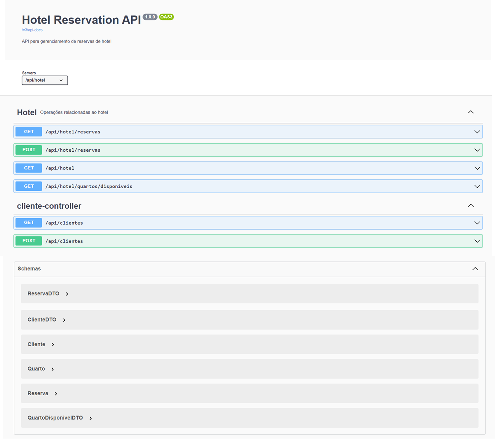

# LAB-04: Design Patterns com Java: Dos Clássicos (GoF) ao Spring Framework

## Sistema de Reserva de Hotel com Spring Boot



Este projeto Java simula um sistema de reserva de hotel, permitindo aos usuários buscar quartos disponíveis, calcular preços e realizar reservas. O sistema utiliza o Spring Boot para facilitar o desenvolvimento e implementa padrões de projeto para garantir uma arquitetura flexível e escalável.

## Tecnologias Utilizadas

* **Java:** Linguagem de programação principal.
* **Spring Boot:** Framework para desenvolvimento rápido de aplicações web Java.
* **Spring Data JPA:** Simplifica o acesso a dados com JPA (Java Persistence API).
* **H2 Database:** Banco de dados em memória para desenvolvimento (pode ser substituído por um banco de dados persistente em produção).
* **Lombok:** Reduz a verbosidade do código com anotações para geração automática de getters, setters, etc. (opcional).
* **Swagger (Springdoc OpenAPI):** Gera documentação interativa da API REST.

## Padrões de Projeto

* **Singleton:** Garante que exista apenas uma instância do serviço de hotel (`HotelService`).
* **Strategy/Repository:** Permite calcular preços de forma diferente para cada tipo de quarto (`TipoQuartoStrategy`) e abstrai o acesso aos dados dos quartos (`QuartoRepository`).
* **Facade:** Simplifica a interface do sistema, fornecendo uma camada de abstração para as operações de reserva (`HotelFacade`).

## Aprendizado

Durante o desenvolvimento deste projeto, foram aplicados e consolidados os seguintes conceitos:

* **Spring Boot:** Configuração e uso do Spring Boot para criar uma aplicação web RESTful.
* **Spring Data JPA:** Utilização de repositórios para acessar dados no banco de dados.
* **Padrões de Projeto:** Aplicação dos padrões Singleton, Strategy/Repository e Facade para melhorar a arquitetura do sistema.
* **API REST:** Criação de endpoints REST para buscar quartos disponíveis, criar reservas e gerenciar clientes.
* **Documentação da API:** Uso do Swagger para gerar documentação interativa da API.

## Exemplo de Uso

**Bash**

```
# Buscar quartos disponíveis:
curl -X GET "http://localhost:8080/api/hotel/quartos/disponiveis"

# Criar uma reserva (quarto 1, cliente 1, entrada em 2024-07-15, saída em 2024-07-20)
curl -X POST "http://localhost:8080/api/hotel/reservas" \
     -H "Content-Type: application/json" \
     -d '{
           "quartoId": 1,
           "clienteId": 1,
           "dataEntrada": "2024-07-15",
           "dataSaida": "2024-07-20"
         }'
```

**Para mais detalhes e exemplos, consulte a documentação da API no Swagger UI:**

```
http://localhost:8080/swagger-ui/index.html
```

## Conclusão

Este projeto demonstra a aplicação prática de conceitos de Spring Boot, Spring Data JPA e padrões de projeto para criar um sistema de reserva de hotel funcional. Ele serve como base para o desenvolvimento de sistemas mais complexos, como plataformas de reserva de hotéis online.
